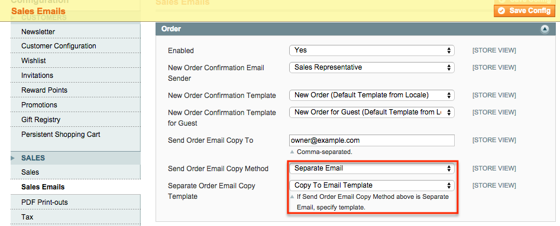
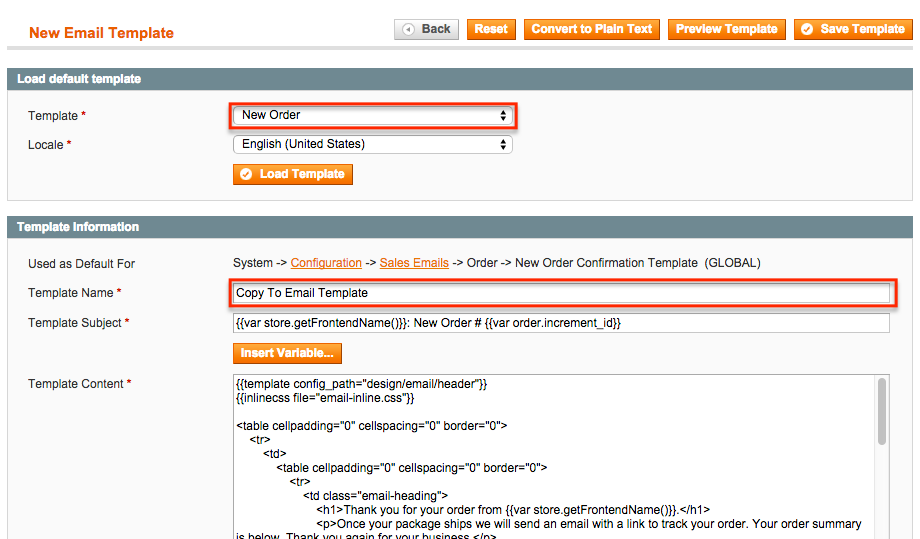

Order Email Copy
==================
Specify an alternate email template to cc new order emails to.

Description
-----------
New order emails get sent to the customer and a copy to any additional 
email addresses. In the admin under System -> Configuration -> Sales -> 
Sales Email -> Order, you can specify additional emails to notify of 
new orders. This extension adds the ability to select a custom template 
to send instead of the same template the customer gets.

How to use
----------

Upload the extension files to your server. In the admin under 
System -> Configuration -> Sales -> Sales Email -> Order, 
set Send Order Email Copy Method to *Separate Email* and select the 
template:

To create a transactional email to use as the copy to template, go to 
System -> Transactional Emails, create a new template and load the New 
Order template copy:

